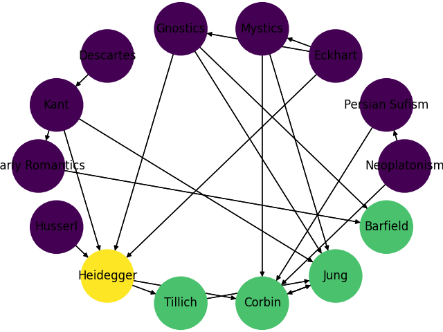

# Episode 46 - Conclusion and the Prophets of the Meaning Crisis

## Recap

+ Vervaeke & Ferarro (2013) theory of wisdom
    + enhancing
        + info processing by *AOM*
        + insightful processing through *mindfulness*
        + the capacity for internalization by *internalizing the sage* and cultivating *sophrosyne*
        + *sophrosyne*: the salience landscape (SL) self-organizes away from self-deception, a tempts towards *true/good*beautiful*
    + coordinating kinds of knowing:
        + propositional - inference
        + proceduaral - insight
        + perspectival - internalization
            + realizing *sophrosyne*
            + cultivate a more moral existence, virtues, coping/caring, meaning in life
    + criticism:
        + missing participatory knowing
        + misrepresenting the relationship between the kinds of knowing
        + missing account of understanding
        + missing account of transformative experience
        + missing aspiration
        + missing gnosis
+ account of understanding
    + basic
        + to grasp the relevance of our knowledge
    + profound
        + integrating basic understanding with the account of *plausibility*
            + *convergence* of a contextually sensitive optimal grip
            + *transferable* to problem formulation/finding/solving in different domains
+ *inspiration* vs *aspiration*
    + __inspiration__: sudden insight-laden transformative experience (L.A Paul)
    + __aspiration__: (A. Callard)
        + incremental transformation
        + not inferential; *proleptic* rationality
            + aspiration and love of wisdom must be rational processes
                + otherwise we get to *performative contradiction*
        + missing *psychology* of aspiration
        + process of aspiration:
            + leaping from `self1` to `self2`
                + eg. music appreciation
            + double-faced symbol (with gnosis): enacted serious play
        + affective component: *wonder*
            + opening up our identity in our world,
            + triggering the transjective relationship,
            + putting it into a developmental trajectory
+ **processing account of wisdom**
    + wisdom is an ecology of psychotechs/cognitive styles that dynamically enhances RR that's central to:
        + inference
        + insight/intuition
        + internalizing (the sage)
        + understanding
        + gnosis
        + transformative experience
        + aspiration
    + the dynamic system/ecology of wisdom is overlapping with the account of *enlightenment*
        + a dynamic system that counteracts *parasitic processing*
    +  wisdom is also a counteracting parasitic processing/self-deception/foolishness
    + wisdom enhances *flourishing* by becoming better connected to yourself/other people/the world
    + wisdom enhances *religio*
        + taking us into *sacredness*
        + enhancing *meaning in life*

## Awakening from the Meaning Crisis

### The Machinery/Schema Summary

+ connection between __wisdom, enlightenment, religio, sacredness__
    + enhancement of religio, meaning in life, encountering with the sacred
    + **the wise cultivation of enlightenment** is __situated__ within
        + a *worldview* that affords *worldview attunement*
            + 4E cogsci: naturalistic explanation of RR, wisdom
        + co-opt network of *communities of practice*
            + in a dynamic equilibrium with a *wisdom wiki*: *credo* function
                + where researchers and practitioners are contributing (top-down, bottom-up) 
+ dealing with perennial problems
+ overcoming historical issues
+ connecting wisdom and enlightenment
+ enhancing meaning in life
+ situating it in the co-opt socio-cultural framework
    + some developing examples already exist
+ individually & collectively awakening from the meaning crisis
+ explained and engineered within a secular scientific worldview
    + not dependent on religion/political ideology

## Network of Prophets of the Meaning Crisis in the 20-21th Century

### Those Who Didn't Make It

+ Wittgenstein: notion of cognitive-cultural grammar
+ Whitehead: process theology

### The Network/Roadmap

+ contrast, connection, causal influence
+ they want to awaken us from the meaning crisis

Prophet | Influences | Main Thought
--- | --- | ---
Descartes | | 
Eckhart | | *why*
Kant | Descartes | *the thing in itself*
Early Romantics | Kant | Schleger, Coleridge
W. James | | father of psychology
Gnosis | Mystics, Eckhart | 
Husserl | | phenomenology
Heidegger | Gnosis, Eckhart, Kant, Husserl |
Tillich | Gnosis, Heidegger | The Courage To Be, revising theology, god beyond the god of theism
Corbin | Heidegger, Jung | symbolism, transjectivity
Jung | Gnosis, Kant, Corbin, Tillich | non-theism, the psyche as sacrement 
Barfield | Gnosis, Early Romantics | participation
Derrda | Heidegger, post-modernism | deconstructionism
Harman | Heidegger, post-modernism | speculative realism, object-oriented ontology
Han | Heidegger, post-modernism |
Kyoto School | Buddhism, James, Heidegger | responsing to the meaning crisis
Nishida | Kyoto School | The Nothingness Beyond God
Nishitani | Nishida | Religion and Nothingness

+ post-modernism:
    + not a homogeneous movement
    + how it connects to the meaning crisis
    + alternative response, instead of
        + wholesale adoption
        + wholesale demonization

#### Drawing of the Prophet Network

## Husserl

### Phenomenology

+ phenomenology leads to existentialsm and deconstructionism
+ Sokolovsky: Intro to Phenomenology
+ *The Crisis of European Sciences and Transcendental Phenomenology*
+ attempt to getting back to a *contact epistemology*
    + influencing Dreyfus and Taylor
+ we have lost *contact* with the world
+ how to get the *contact* back
    + not just by everyday introspection

#### Schema/Setup

+ a disciplined practice where you pay *experimental/exploratory/reflective/prohibitive attention* to the way in which we are in *contact* with the world
+ __contact__: intentionality
    + __intentionality__: any mental directedness/*agency*
        + eg. looking *at* the bottle, reaching *towards* the book, thinking *about* Paris
        + **noesis**: perspectival knowing
            + gr. *noein* - to intend/perceive
            + gr. *nous* - mind, thought
            + exercise of reason
    + how the __world__ is disclosed
        + a meaningfully structured env: *arena*
        + **noema**: debated term (sth in consciousness or in the world)
            + *noema*: from *nous*, lit. thought;
                + perception, that which is perceived, object/content of thought

#### Criticism

+ Sparrow: phenomenology fails as a kind of *realism*, and stays instead an *idealism*

#### Re-definition

+ *experimental/exploratory/reflective/prohibitive attention* on the *transjective* relationship
    + reflective attention paid to your perspectival knowing of the transjective relationship
+ huge influence on 4E cogsci

## Heidegger and Phenomenology

### Criticism

#### No Contact

+ Husserls' work has not given us contact
    + no account of participatory knowing: how *agent* and *arena* are fundamentally related
        + so that the perspectival relationship could unfold
+ but: Merleau-Ponty's ideas about *embodiment/embeddedness* are trying to get at the connection between perspectival and participatory knowing
+ participatory knowing is needed to be set within an *ontology*
    + existential modes
    + how does the transjective relationship sit within an overall account off the *structure of being*
+ if we are out of touch with *our being* and through *our being*
    + we are out of touch with *Being* itself

#### Cartesian Bondage

+ Husserl is trapped within the Cartesian cognitive-cultural grammar
    + that cuts us off from the world
    + being trapped within our *subjectivity*
+ Husserl's phenomenology remains an ideology, not realism

### Deeper Contact

1. how do we get to the deeper contact ?
2. how do we open up participatory knowing, situate it in an ontology, and break free from the Cartesian grammar ?

#### Response

+ direct the phenomenological/existential realization to *our being*
    + thus connecting to the participatory knowing
+ we are the beings whose *being* is in question
    + *being*: grounding the Husserlian framework in a participatory
+ human beings do not have an *essence*
    + in contrast with a gazelle for example whose identity is set
    + our existence is in question
    + `I existed before who and what I am has come into being.`
    + our *existence* precedes our *essence*
+ from a phenomenological stance we are in question to ourselves
    + what is it to be a person ?
    + what is the meaning of my life ?
        + what makes it meaningful to me ?
+ Heidegger is trying to get you into *aporia* and to remember the *being mode*
    + not manipulating/controlling to satisfy your having needs,
    + but stepping back and confronting mystery
        + in a development process of mystery
        + going through transformation
    + realize that *you are the being whose being is in question*
        + waking you up phenomenologically (not theoretically)
        + *dasein*: being there (Heideggerian neologism)
            + *aporatic* element of participatory knowing: *my being is in question*
+ linking *participatory knowing* to *ontology* through *my being in question
    + self-knowledge leads to the knowledge of ontology
        + by knowing myself as *the being whose being is in question*, putting *Being* itself into question (the ontological question)
        + *who I am* and *what Being is* are co-determining questions/mysteries
+ by phenomenologically exploring *dasein*, coming into contact with our modal existence:
    1. remembering the *being mode*
    2. being opened up to the *wonder* / *mystery* of Being itself
+ we are self-defining things, but not egotistically
+ because we are the beings whose being is in question
    + we can deepen the contact by phenomenologically exploring *dasein*

#### Style

+ reading Heidegger is difficult:
    + constant self-criticism/refinement/neologisms

#### Main Argument

+ the history of *metaphysics* (coming out of the axial revolution) is the history of *nihilism*
    + the cultural-cognitive grammar / metaphysical framework that we inherited from the axial age has driven us to nihilism / the meaning crisis
    + *metaphysics* is a pejorative term for Heidegger
+ project of investigating *dasein* and breaking free from the grammar
    + existentially reestablishing our contact with *Being* / *sati*
        + that is the Heideggerian response to the meaning crisis
